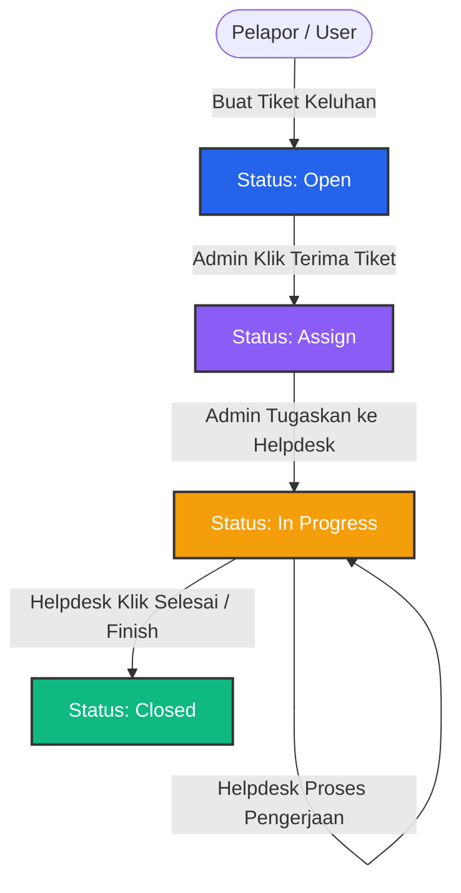

# LAPORAN UJIAN AKHIR SEMESTER (UAS)
## PENGEMBANGAN APLIKASI MOBILE: E-TICKETING HELPDESK

---

## 1. Flow Diagram & Alur Kerja Sistem (Workflow)

Aplikasi ini memiliki 3 Peran Utama: **User (Karyawan/Pelapor)**, **Helpdesk (Petugas Teknis)**, dan **Admin**. Alur tiket berjalan secara otomatis berdasarkan interaksi antar peran tersebut tanpa adanya tombol ubah status manual.

### A. Siklus Hidup Tiket (Ticket Lifecycle)

### B. Deskripsi Detail Alur Peran

1. **User (Pelapor):**
   * Membuat tiket laporan keluhan baru dengan mengisi Judul, Deskripsi, Kategori, Prioritas, dan Lampiran Foto.
   * Tiket baru otomatis tersimpan dengan status **`Open`**.
2. **Admin:**
   * Membuka tiket berstatus `Open` lalu mengeklik tombol **TERIMA TIKET**, status otomatis berubah menjadi **`Assign`**.
   * Memilih petugas **Helpdesk** dari dropdown. Begitu Helpdesk dipilih, status tiket otomatis berubah menjadi **`In Progress`**.
3. **Helpdesk:**
   * Melihat daftar tugas tiket yang ditugaskan kepada dirinya.
   * Melakukan pengerjaan masalah dan dapat berdiskusi melalui kolom komentar chat di detail tiket.
   * Setelah selesai mengerjakan, Helpdesk mengeklik tombol **SELESAI / FINISH** di detail tiket. Status otomatis berubah menjadi **`Closed`**.

---

## 2. Struktur Database & Skema Tabel (Supabase Cloud)

Sistem menggunakan database PostgreSQL di **Supabase Cloud** dengan relasi antar tabel sebagai berikut:

### A. Tabel `users` (Data Akun Pengguna)
Menampung kredensial login dan hak akses peran.
| Nama Kolom | Tipe Data | Atribut | Keterangan |
| :--- | :--- | :--- | :--- |
| `id` | `text` | Primary Key | ID Unik Pengguna |
| `name` | `text` | Not Null | Nama Lengkap |
| `email` | `text` | Unique, Not Null | Email Login / Username |
| `password` | `text` | Not Null | Password Akun |
| `role` | `text` | Not Null | Hak Akses (`Admin`, `Helpdesk`, `User`) |
| `is_active` | `boolean` | Default: `true` | Status keaktifan akun (bisa dinonaktifkan Admin) |

### B. Tabel `tickets` (Data Tiket Keluhan)
Menyimpan informasi utama laporan keluhan yang dibuat pengguna.
| Nama Kolom | Tipe Data | Atribut | Keterangan |
| :--- | :--- | :--- | :--- |
| `id` | `text` | Primary Key | ID Tiket (Contoh: `T-17823...`) |
| `title` | `text` | Not Null | Judul Permasalahan |
| `description` | `text` | Not Null | Deskripsi Kronologi |
| `category` | `text` | Not Null | Kategori (`Hardware`, `Software`, `Network`) |
| `priority` | `text` | Not Null | Tingkat Kepentingan (`Low`, `Medium`, `High`) |
| `status` | `text` | Not Null | Status (`Open`, `Assign`, `In Progress`, `Closed`) |
| `created_by` | `text` | Not Null | Nama Pelapor |
| `assigned_to` | `text` | Nullable | Nama Helpdesk yang ditugaskan |
| `attachment_name` | `text` | Nullable | Nama file gambar simulasi lampiran |
| `created_at` | `timestamp` | Not Null | Waktu tiket dibuat |
| `updated_at` | `timestamp` | Not Null | Waktu update terakhir |

### C. Tabel `comments` (Tanggapan / Chat Diskusi)
Menyimpan diskusi chat pemecahan masalah di dalam detail tiket.
| Nama Kolom | Tipe Data | Atribut | Keterangan |
| :--- | :--- | :--- | :--- |
| `id` | `text` | Primary Key | ID Komentar |
| `ticket_id` | `text` | Foreign Key (cascade) | Relasi ke `tickets.id` |
| `user_name` | `text` | Not Null | Nama pengirim komentar |
| `user_role` | `text` | Not Null | Peran pengirim komentar |
| `content` | `text` | Not Null | Isi teks chat komentar |
| `created_at` | `timestamp` | Not Null | Waktu pengiriman chat |

### D. Tabel `history_logs` (Audit Timeline Riwayat)
Merekam jejak audit otomatis setiap kali terjadi perubahan pada tiket.
| Nama Kolom | Tipe Data | Atribut | Keterangan |
| :--- | :--- | :--- | :--- |
| `id` | `text` | Primary Key | ID Logs |
| `ticket_id` | `text` | Foreign Key (cascade) | Relasi ke `tickets.id` |
| `action` | `text` | Not Null | Deskripsi aksi (buat, assign, close) |
| `performed_by` | `text` | Not Null | Nama pelaku aksi |
| `created_at` | `timestamp` | Not Null | Waktu aksi dicatat |

### E. Tabel `notifications` (Notifikasi Keluhan)
Memicu pemberitahuan real-time untuk perubahan status atau komentar baru.
| Nama Kolom | Tipe Data | Atribut | Keterangan |
| :--- | :--- | :--- | :--- |
| `id` | `text` | Primary Key | ID Notifikasi |
| `ticket_id` | `text` | Not Null | Referensi ID Tiket terkait |
| `title` | `text` | Not Null | Judul Notifikasi |
| `description` | `text` | Not Null | Detail singkat notifikasi |
| `is_read` | `boolean` | Default: `false` | Status notifikasi dibaca |
| `created_at` | `timestamp` | Not Null | Waktu notifikasi muncul |

---

## 3. UI/UX & Fitur Unggulan Aplikasi

Desain UI/UX dirancang mengikuti kaidah aplikasi mobile modern:
* **Glassmorphism & Sleek Accent:** Memadukan warna Navy Slate dan Vibrant Blue (`#2563EB`) untuk kesan profesional.
* **Auto Responsive Dark Mode:** Mendukung perpindahan tema gelap/terang secara otomatis yang ramah di mata.
* **Priority Color Tags:** Label prioritas dengan warna dinamis (Merah = High, Oranye = Medium, Hijau = Low) untuk kemudahan visualisasi.
* **Timeline Audit Trail:** Tab riwayat tiket divisualisasikan dalam bentuk alur vertikal (timeline) yang informatif.

---

## 4. Backend & API Service Integration

Aplikasi ini menggunakan **Supabase Cloud Serverless Database API** untuk sinkronisasi data real-time:
* **Autentikasi Aman:** Verifikasi login mencakup validasi email, pemeriksaan status aktif akun, dan pembatasan menu berdasarkan role.
* **Integrasi SDK Supabase:** Menggantikan peran backend manual (`api.php`) dengan REST API bawaan Supabase Cloud, terhindar dari isu CORS browser di Flutter Web.

---

## 5. Video Tutorial Pemakaian Aplikasi

> [!IMPORTANT]
> **Petunjuk Perekaman & Pemasangan Video UAS Anda:**
> 1. Rekam layar HP / Browser Anda saat mendemonstrasikan aplikasi (skenarios: login -> buat tiket -> admin assign -> helpdesk selesaikan tiket -> komentar chat).
> 2. Simpan file video tersebut dengan format **MP4** (misal: `tutorial_uas.mp4`).
> 3. Pindahkan file video tersebut ke folder proyek Anda di: `C:\laragon\www\aplikasimobileUTS\tutorial_uas.mp4`.
> 4. Setelah video dipindahkan, Anda dapat menyematkan video tersebut di bawah ini agar dosen penguji bisa langsung memutarnya di dalam laporan markdown ini.

### Video Demonstrasi Aplikasi E-Ticketing
Ganti file di bawah ini dengan video hasil rekaman Anda untuk menampilkan preview pemutar video tersemat:

